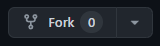
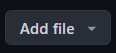
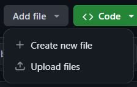
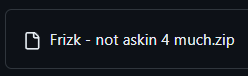

**THIS IS A BRANCH FOR UPDATING THE DOCUMENTATION OF THIS REPOSITORY. PLEASE DO NOT UPLOAD ANY CHARTS HERE, INSTEAD USE THE [MAIN BRANCH](https://github.com/Encore-Developers/songs/tree/main)**
# songs
Songs for Encore

## Publishing your charts

> [!WARNING]
> Songs that are officially in *active plastic instrument games* will not be accepted.   However, Clone Hero allows Pad additions and charts from their game. As well as YARG, with the exception that audio can't be taken from the game.
> [**Here is a mostly accurate and updated spreadsheet of songs and games that are allowed for submission.**](https://docs.google.com/spreadsheets/d/13Lln7bpex5GBVCaxTNHuTOL8PQlWL-6tm8KLPTnLJqI/edit?usp=sharing)   This spreadsheet covers the base songs, it may be useful to check Wikipedia for what songs are in that game for DLC.    For customs of someone else's work, please assure that you have permission to upload their charts. (This includes YARN and community projects such as RB3 Plus and TBRB Custom DLC Project, to name a few.)   
> **Songs that Epic Games owns the rights to are banned entirely (this includes in-house Harmonix tracks).**   
> *Encore does NOT endorse piracy.*

> The charting resources here are quite outdated and might not have everything listed 
> We will have better charting documentation in the near future. 
> Meanwhile, it is HIGHLY encouraged to ask in the Discord for any help or guides!

**If your song is really old, and you have not updated it.   Or there you haven't switched formats--Please update your `info.json` to the new format or use global `song.ini` formatting.   Updated `info.json` - [CHARTS.md](https://github.com/Encore-Developers/Encore/blob/main/CHARTS.md)   `song.ini` - [song-ini.md]()**

To publish a song, the chart must go under review and be validated.
In order to publish a song, follow these steps:

- Fork the `songs` repository

    Create a fork of this repository by clicking on the **Fork** button. *Don't clone it!*

    

- Make a new branch
    Inside your new fork, click on the button that says **Main**, after that click on **View All Branches** in the dropdown menu.  
    
    
    
    After you select View All Branches, click on the green button that says **New Branch** then type in the name of your branch, preferably your song name.   This process allows you to more easily create pull requests for multiple songs.

- Archive your song
    
    Package the chart into a folder. After, create a ***zip*** archive of the folder.

    The limit for uploading files is **100 MB** using the [Desktop App](https://desktop.github.com/download/) and **25 MB** uploading using the website, as set by GitHub. However, we recommend your zip to be at most **50 MB** if it has full stems.

    **Only zip files are accepted.   Make sure to add all your files within a folder inside the archive's root.**

- Upload the song

    To upload your song as a **zip** archive, press the **Add File** button, located besides the green **Code** button.

    

    After, click on the **Upload files** button that shows up in the dropdown menu.

    

    Now, drag your **zip** song to the page.

    After your **zip** is done uploading, it will show up below the space to drag.

    

    After, click on **Commit changes** to confirm the song upload. Make sure you are committing to the **main** branch.

    *If you'd like to add multiple charts, you should create multiple branches and commit each chart to each branch, then create multiple pull requests, so this process can stay organized.*

- Create the pull request

    Click on the **Contribute** button below **Add file**. After that, click on **Open pull request**

    Under **Add a title**, specify your song name.

    Under **Add a description**, follow the instructions on the PR template.

    When you are done, click on **Create pull request**.

- Wait for approval

    Once you've created your pull request, a chart verifier will review the chart.   If it takes a long time for it to be reviewed (about three weeks), please notify it somewhere in the Encore Discord.   
    A chart verifier will look at your chart and inspect it for any issues, if they do find issues, they'll make a comment to your pull request and notify you of any changes required, you may not get a notification about it so it may be best to look at the song-updates channel in the Discord. 
    Otherwise, your chart will be accepted and be considered Verified.  
    During this process your chart will likely be added to [EncoreCustoms](https://github.com/Encore-Developers/EncoreCustoms), the api and song database that contains all of the custom charts made for Encore.   This is then used to be added to the Encore bot in the Discord and to the actual [Encore Customs](https://encore-developers.github.io/EncoreCustoms/) website.

## Resources for charting

- [Download REAPER](https://www.reaper.fm/download.php)

- [Encore REAPER Templates](https://drive.google.com/drive/folders/1AHLTynTHwzVogv2hT5UmN7Lzx24hWXrW?usp=drive_link)

- [YARG Examples](https://github.com/shadowflower64/yarg-examples/tree/main)

- [Original Chart Previewer](https://github.com/NarrikSynthfox/EncorePreviewer)

- [Fork of the Chart Previewer with INI and KEYS Support](https://github.com/WowItsOnlyConnor/EncorePreviewerINI)

- [Classic Vocals Previewer](https://github.com/tposejank/EncoreVocalPreview)

- [Encore PAD Charting (Slightly outdated but probably better than the rest of the written guides here for Pad)](https://docs.google.com/document/d/1Xqi_IR-FYI-PplGYDTO0HWMW_VGBshPFfFgZkps1tRk/edit?usp=sharing)

- [REAPER Charting 101 (Doesn't contain documentation for Pad, useful if you're getting to know REAPER)](https://docs.google.com/document/d/1b7KcHJ5uX-jcAjeRTStJRxcEvZ5ohYNOeVvezG03vwA/edit#heading=h.u8vd9w9b6n0y)

- [Rock Band 3 Charting Docs](http://docs.c3universe.com/rbndocs/index.php?title=Authoring)

- [TheNathannator's GuitarGame_ChartFormats (May not be too useful for charting, but contains a lot of documentation regardless)](https://github.com/TheNathannator/GuitarGame_ChartFormats)

