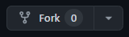
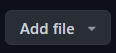
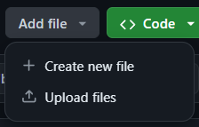
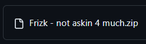

# songs
Songs for Encore

## Publishing your charts

> [!WARNING]
> No official songs! These will not be accepted. 
> Encore does NOT endorse piracy.

> The charting resources and guide here are quite outdated (not that you can't use them, there are just more things available) 
> We'll have probably better charting documentation soon. 
> Meanwhile, it is HIGHLY encouraged to ask in the Discord for any help or guides!

*.json songs are no longer supported*

To publish a song, the chart must go under review and be validated.
In order to publish a song, follow these steps:

- Fork the `songs` repository

    Create a fork of this repository by clicking on the **Fork** button. *Don't clone it!*

    

- Archive your song
    
    Package the `song.ini`, stems, and album art into a folder. After, create a ***zip*** archive of the folder.

    The limit for uploading files is **100 MB**, as set by GitHub. However, we recommend your zip to be under **20 MB**.

    **Only zip files are accepted.   Make sure to add all your files within a folder inside the archive's root.**

- Upload the song

    To upload your song as a **zip** archive, press the **Add File** button, located besides the green **Code** button.

    

    After, click on the **Upload files** button that shows up in the dropdown menu.

    

    Now, drag your **zip** song to the page.

    After your **zip** is done uploading, it will show up below the space to drag.

    

    After, click on **Commit changes** to confirm the song upload. Make sure you are committing to the **main** branch.

    *If you'd like to add multiple charts, you should create multiple branches and commit each chart to each branch, then create multiple pull requests, so this process can stay organized.*

- Create the pull request

    Click on the **Contribute** button below **Add file**. After that, click on **Open pull request**

    Under **Add a title**, format the Pull Request name as **Song Title - Artist** or the other way around.

    Under **Add a description**, follow the instructions on the PR template.

    When you are done, click on **Create pull request**.

- Wait for approval

    Your chart will be approved after it is verified. If there are any issues, the reviewers will comment on your PR about them.
